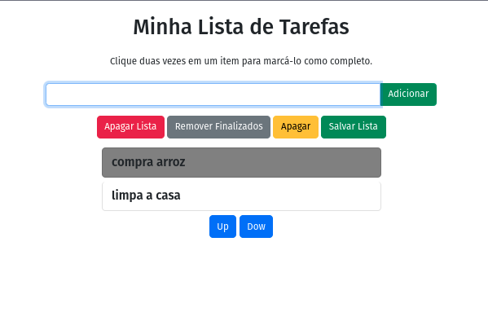

# Todo List



# Índice

* [Título e Imagens Home](#todo-list)
* [tecnologias utilizadas](#tecnologias-utilizadas)
* [Descrição do projeto](#descrição-do-projeto)
* [Status do Projeto](#status-do-projeto)
* [Funcionalidade do projeto](#🔨-funcionalidade-do-projeto)
* [Acesso ao Projeto](#acesso-ao-projeto)

# Tecnologias utilizadas


# Descrição do Projeto

Este projeto foi desenvolvido como parte da formação de Desenvolvedor Web na [Trybe](https://www.betrybe.com/). O objetivo do projeto é ensinar o uso de ...

# Status do Projeto

> 💹 Alpha 💹

# 🔨 Funcionalidade do projeto

- funcionalidade

# Acesso ao projeto

Para acessar e executar este projeto, siga os passos abaixo:

1. Certifique-se de ter o Node.js e o npm instalados em sua máquina.

2. Clone o Projeto

```bash
git clone NomeDaPasta
```

3. Entre no projeto

```bash
cd NomeDaPasta
```

4. inicie o projeto

```bash
npm start
```
